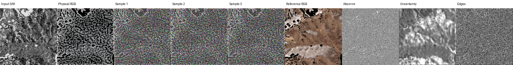

# Sentinel Translate V3.1

V3.1 is the high-frequency and RMSE-focused successor to V3. It migrates the V3 shared
Transformer while replacing the channel fusion, physical detail decoder, and stochastic residual
training. It remains independent from V1/V2/V3 artifacts and reads the existing 36,630 patches.

## Guarantees in this implementation

- A channel-gated linear/quadratic/detail projector preserves spectral and polarization structure.
- The four-level pyramid includes an `H/1` source skip and a bounded deterministic detail head.
- Target GSD directly modulates the physical decoder, not only the shared encoder.
- Dynamic target kernels support arbitrary registered channel descriptions.
- Small optical/SAR radiometric likelihood heads produce a deterministic mean and uncertainty.
- Rectified-flow Residual-DiT learns strict 4x4 block-Laplacian optical RGB or log-SAR residuals.
- Residuals have zero block mean by construction; SAR losses include spectrum and speckle scale.
- Optical and SAR physical downsampling use reflectance and linear intensity respectively.
- Joint task probabilities are 35/35/15/15 and temporal weights follow the V3 protocol.
- Checkpoints contain model, EMA, optimizer, scheduler, RNG states for every rank and sampler position.

The Sentinel experiment validates bidirectional sharing and continuous synthetic GSD conditioning. It
does not establish zero-shot transfer to unseen sensors.

## Verify

```bash
cd /data/code/sentinel_translate_v3_1
PYTHONPATH=src pytest -q
ruff check .
PYTHONPATH=src python -m sentinel_v3.cli --config configs/smoke.yaml model-info
```

## Train

The mandatory 64-patch connectivity test is:

```bash
PYTHONPATH=src python -m sentinel_v3.cli --config configs/smoke.yaml train --limit 64 --max-steps 100
```

The corrected V3.1.1 high-frequency run starts from the stable V3.1 physical
checkpoint at `checkpoints/physical/step_0012000.pt`, retrains Visual for 40k
steps, and then runs a 10k low-learning-rate Balance phase on eight GPUs with
`bash scripts/launch_8gpu.sh`. It writes only to `checkpoints_v311`, so invalid
legacy Balance checkpoints cannot be resumed accidentally. For an interrupted
phase, use `train --resume checkpoints_v311/latest.pt` with the same stage and
maximum step. `--init` is only for loading weights at a new phase and intentionally
resets optimizer and data-stream state.

The default loader uses zero workers because that is required for exact sample-level resume. Increasing
`num_workers` improves throughput but only preserves epoch-level ordering across a restart.

## Evaluate

`scripts/evaluate_closed_splits.sh` reads the three closed test splits directly from the existing
manifest and raw rasters. It writes JSON reports and 32 fixed-seed panels per direction. Use
`select-checkpoint` with validation reports and the V1 Mean RMSE/SAM to create `best_joint.pt`; the joint
file is deliberately withheld when baseline values are absent.

## Current experimental result

The current V3.1 run is an engineering experiment, not a validated final model.
The stable Visual checkpoint and an eight-sample fixed-seed diagnostic are documented
in [docs/RESULTS.md](docs/RESULTS.md). The subsequent Balance stage diverged and was
stopped; its checkpoints must not be used for evaluation or publication.

The exact local and future multi-sensor data/weight requirements are in
[requirement.txt](requirement.txt). Raw data and multi-gigabyte checkpoints are
deliberately excluded from Git.

### Diagnostic panels

These fixed-seed V3.1 panels are visible directly in the repository. They are
failure diagnostics, not success examples; see [the results analysis](docs/RESULTS.md).




