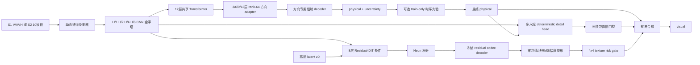
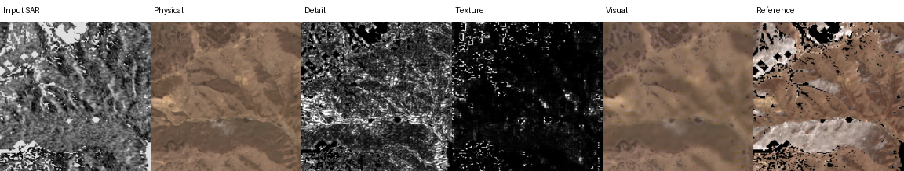
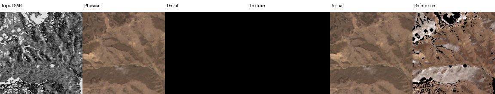
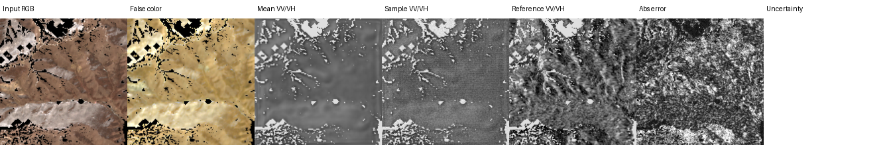

# Sentinel Translate V3.2 当前完整技术说明

更新日期：2026-08-09

代码目录：`/data/code/sentinel_translat/v3.2`
验证协议：`validation_temporal`，463 个固定样本，协议哈希
`891d34fe1e507ce66b8f6d7f93d096ad911f77112ad57fe22611c8ec4b46594b`

本文是 V3.2 当前实现和实验状态的单一事实来源。它区分“已经实现并验证”、
“已经实现但失败”和“正在实验”三种状态，不把计划写成结果。

## 1. 目标与输出定义

V3.2 不要求一个随机输出同时承担最低像素误差和最真实纹理，而是提供两个输出：

```text
physical = 确定性的传感器条件均值/低频与辐射预测
visual   = bounded(physical + deterministic_detail + stochastic_texture)
```

- `physical` 是 RMSE、SAM 和辐射偏差的主结果，必须确定、可复现。
- `visual` 可以增加可预测边缘和条件分布纹理，但只有完整验证集通过硬门槛后才能发布。
- Optical 在 logit 空间合成后经 sigmoid 回到 `[0, 1]`；同时报告投影前越界率。
- SAR 在 dB 空间合成，最终限制到模型支持的物理范围 `[-50, 5] dB`。
- `translate(..., mode="physical"|"visual")` 保持兼容；visual 还返回 detail、texture、
  amplitude 和越界诊断。

当前状态：physical 已通过；SAR visual 已通过；Optical visual 尚未通过。当前安全
checkpoint 会让 Optical visual 回退为 physical，而不是发布已知有害的高频。

## 2. 数据、单位和监督标签

### 2.1 输入与目标

| 方向 | 输入 | physical 标签 | visual 使用通道 | 单位 |
| --- | --- | --- | --- | --- |
| SAR→Optical | Sentinel-1 VV/VH | Sentinel-2 全部 10 个训练波段 | B04/B03/B02 RGB | 反射率 `[0,1]` |
| Optical→SAR | Sentinel-2 10 波段 | Sentinel-1 VV/VH | VV/VH | dB |

有效掩膜来自固定 manifest、SCL/无效像素规则和固定中心 crop。所有候选模型使用完全
相同的 pair、crop、mask、通道顺序和单位。2017–2018 train 可用于训练；validation
和封闭 test 不进入 codec、detail 或 flow 训练。

高频监督时间权重为：

```text
delta_days = 0 -> 1.00
delta_days = 1 -> 0.25
delta_days = 2/3 -> 0.00，所有 residual 参数精确零梯度
```

此外，配准位移超过 0.5 px、云/阴影、低有效率等 patch 由审计 sidecar 排除。当前
sidecar 包含 3,044 个可用高频 patch。

### 2.2 四类标签不能混为一谈

1. **Physical 标签**

   直接使用目标传感器完整像素。Optical 同时监督 Huber/MSE/NLL、梯度、局部结构、
   SAM、光谱幅值和通道偏差；SAR 还监督 VV/VH 关系和全局/通道 dB 偏差。

2. **Deterministic detail 标签**

   ```text
   residual = target - stopgrad(physical)
   optical_detail_gt = H(residual)
   sar_detail_gt = H(median3x3(residual))
   ```

   SAR 先做 3×3 中值，是为了不把单个 speckle 和极端散射点误认为确定性道路/边缘。
   `H` 是三层 fine-to-coarse Laplacian high-pass。detail head 另有 4×4 置信度标签：
   比较预测 band 与零输出谁更接近真值，只释放有证据的 band。

3. **Codec 标签**

   Codec 预训练重建 `H(target)`，而不是整幅图。Optical RGB 与 SAR VV/VH 有独立 I/O
   head，共享 4× trunk，latent 为 16 通道并按模态标准化。Codec 先冻结，flow 再训练，
   避免表示和生成分布同时漂移。

4. **Flow endpoint 标签**

   ```text
   texture_gt = H(target - stopgrad(physical)) - stopgrad(det_detail)
   z1 = frozen_codec.encode(texture_gt)
   ```

   这是不可由 deterministic 分支稳定预测的剩余高频。它不是整幅 RGB/SAR 图，也不是
   physical 本身。

## 3. 完整模型框架



### 3.1 Physical encoder/decoder

- 每个输入通道有 8 维物理描述符，不把所有波段当普通 RGB。
- ChannelProjector 使用线性、二次和局部 detail 投影，并学习输入通道权重。
- CNN 生成 H/1、H/2、H/4、H/8 特征；H/8 进入 hidden=768、12 层、12 头
  Transformer。
- 第 3/6/9/12 层有 Optical/SAR 各自的 rank-64 residual adapter。
- 方向专用 radiometric head 输出均值和 log variance；共享参数双任务训练可使用 PCGrad。
- GSD、季节、轨道等 metadata 进入条件向量；可选时序先验只使用 train acquisition，
  未覆盖位置严格回退神经 physical。

### 3.2 Deterministic detail

- 使用完整四层 FPN，不只使用 H/8 scene token。
- Optical/SAR 有独立输入/输出 head，共享 trunk。
- 三层 Laplacian band 从细到粗训练，课程顺序先稳定中/粗结构，再开放最细 band。
- 损失：Charbonnier、gradient、Edge-F1 surrogate、局部 SSIM 和稀疏约束。
- 推理必须使用已校准的方向阈值；2026-08-09 修复了常规推理未传入该阈值的问题。
- 当前学习式 detail 的安全覆盖率极低：Optical `0.0645%`、SAR `0.0414%`，因此它
  基本回退零输出。这是实验结论，不是成功的 detail 恢复。

### 3.3 Residual codec

- Optical 3 通道、SAR 2 通道独立 I/O head，共享 residual trunk。
- 4× 空间压缩、16 通道 latent、按模态 running mean/std 标准化。
- Optical 损失：Charbonnier、梯度、全局/局部频谱、结构/DISTS。
- SAR 损失：Charbonnier、梯度、频谱、局部方差和 speckle scale。
- 252 样本重建审计在 step 3,000 得到 Optical MAE `0.0037866`、SAR MAE
  `0.53810 dB`，codec gate 通过。

### 3.4 高频生成器：当前是 rectified flow，不是 bridge diffusion

当前正式代码没有使用 DDPM 的逐步去噪标签，也没有使用从 degraded image 出发的
diffusion bridge。它是条件 rectified flow：

```text
z0 ~ Normal(0, sigma_modality^2 I)
z1 = codec.encode(texture_gt)
t  ~ Uniform(0, 1)
z_t = (1-t) z0 + t z1
velocity_gt = z1 - z0
velocity_pred = ResidualDiT(z_t, t, H/1..H/8, target descriptors)
```

训练主损失是 robust velocity loss，并有低 t 权重更大的单步 endpoint 高频、FFT、
amplitude 等约束。推理从 `z0` 出发，用固定步数 Heun 积分到 `t=1`，再经冻结 codec
解码。V4 的 noise scale 为 Optical `0.05`、SAR `0.35`。

因此准确表述是“从噪声经条件 rectified flow 生成 residual latent”。“Residual
Diffusion Bridge / target-consistent restoration drift”是下一轮 Optical 候选分布的
设计方向，尚未成为当前已验证 checkpoint。

### 3.5 多尺度条件、幅度和合成

- H/1、H/2、H/4、H/8 都投影到 latent 网格，通过每层零初始化 gate 注入 DiT。
- Spatial-Frequency Adapter 同时处理 depthwise 空间局部和 rFFT 频率响应。
- amplitude head 预测每个 4×4 block 的 robust RMS，上限 Optical `0.15`、SAR `6 dB`。
- 生成 residual 先 high-pass、块 RMS 归一化，再乘预测 amplitude。
- SAR 每个 4×4 block 强制零 dB 均值，避免 texture 改写 physical 局部均值。
- Optical 限制 chroma，合成前报告越界率，不能用 clamp 掩盖幅度失控。

### 3.6 Texture risk gate

幅度阈值搜索证明“幅度大”不等于“纹理正确”。因此新增一个只用于 Optical 的 4×4
risk head。它输入 source pyramid 和候选 texture 的 luminance/chroma/RMS/gradient
统计，预测该 block 是否比 physical 更好。

训练候选由冻结 flow 生成，不读取 target；target 只用于构造监督标签：

```text
risk(x) = local_L1(x,target)/0.05
        + 0.25 * local_L1(H(x),H(target))/0.02
benefit = risk(physical) - risk(candidate)
positive iff benefit > 0.05 * risk(physical)
```

64-patch connectivity 中严格正类比例为 `0%`，说明 V4 Optical 候选没有可学习的稳定
5% 局部收益。风险头正确保持 0% 发布，但它只能止损，不能把错误候选变成好候选。

### 3.7 正在实验：physical 频带锚定

代码已加入三个非负 Laplacian band scale，用 physical 自身方向正确的边缘做小幅
deterministic sharpening，并提供 `calibrate-anchor-detail`。默认 scale 全为 0，尚未
完成 32/463 样本校准，所以不能写成结果。只有 RMSE、坏场景比例、越界、LPIPS、
DISTS、Edge 和 PSD 同时通过时才会写入非零 scale。

## 4. 从 physical 到高频的实际实现顺序

### 阶段 A：固定协议和 physical

1. 固定 463 样本、crop、mask、单位和 protocol hash。
2. 同协议重评 V1 Mean、V2 Refiner、V3 physical 多个 step。
3. 若旧 checkpoint 不够，训练方向 adapter 和 radiometric head；共享参数用 PCGrad。
4. 每 1k 保存/验证，按 physical/visual/joint 分开选 best。
5. physical 过硬门槛后冻结，后续高频不得反向破坏它。

### 阶段 B：高频数据审计和 codec

1. 只保留 train 2017–2018、`delta_days<=1` 和配准合格 patch。
2. 先训练共享 residual codec 并校准 latent mean/std。
3. codec 重建过门槛后冻结。

### 阶段 C：deterministic detail

1. 构造 `H(target-physical)`，SAR 先中值去 speckle。
2. 三频带、结构可靠性和 confidence 联合训练。
3. 在验证集按“相对零输出不恶化”校准 release threshold。
4. 当前结果显示学习式 detail 几乎不可安全释放，因此回退为零。

### 阶段 D：stochastic residual flow

1. 构造 `texture_gt` 并用冻结 codec 编码为 `z1`。
2. 训练 rectified-flow velocity、endpoint、频谱和 amplitude。
3. 固定 seed 做 1k quick、5k full 验证，禁止 best-of-K。
4. V4–V7 Optical 均失败，已停止扩训；SAR 持续通过。

### 阶段 E：发布校准和风险回退

1. 联合搜索 Optical amplitude floor、alpha、detail 开关。
2. 32 样本没有候选同时改善 LPIPS/DISTS/Edge/PSD。
3. risk head connectivity 进一步证明不存在稳定 5% 正收益块。
4. 当前安全策略：Optical detail=0、texture=0、visual=physical；SAR 保留生成 texture。

## 5. 当前定量结果

### 5.1 Physical：463 样本，已通过

| 指标 | 当前值 | 门槛 | 状态 |
| --- | ---: | ---: | --- |
| SAR→Optical RMSE | 0.0382369 | ≤ 0.03909 | 通过 |
| SAR→Optical SAM | 5.59574° | ≤ 5.716° | 通过 |
| Optical→SAR RMSE | 4.87565 dB | ≤ 5.0 dB | 通过 |
| Optical→SAR signed bias | 0.15234 dB | ≤ 0.5 dB | 通过 |

完整报告：[v32_physical_full_463.json](results/v32_physical_full_463.json)。

### 5.2 V4 flow：463 样本

| 指标 | Physical | V4 visual | 结果 |
| --- | ---: | ---: | --- |
| Optical RGB RMSE | 0.024424 | 0.026223 | `1.0737×`，失败 |
| LPIPS improvement | - | `-25.02%` | 失败 |
| DISTS improvement | - | `-20.07%` | 失败 |
| Edge F1 | 0.42215 | 0.40080 | 失败 |
| Optical PSD distance | 0.005193 | 0.005054 | 改善 |
| RMSE 退化>5%的场景 | - | 60.91% | 失败 |

V5 加 composed pixel/perceptual loss后 quick32 RMSE 比例 `1.0904×`；V6 加无目标泄漏
rollout 后为 `1.0876×`；V7 Optical 从零 latent 训练后 full463 为 `1.1620×`，LPIPS/
DISTS 分别恶化 `37.74%/36.55%`。三条路线均停止。

SAR visual 在 V4 full463 同时改善：

| SAR 统计 | Mean/physical | Visual | 状态 |
| --- | ---: | ---: | --- |
| PSD distance | 0.44849 | 0.24567 | 改善 |
| ENL error | 0.11401 | 0.06817 | 改善 |
| Histogram distance | 0.004137 | 0.001466 | 改善 |
| P01 tail error | 4.0265 dB | 1.8349 dB | 改善 |
| P99 tail error | 6.1391 dB | 4.5237 dB | 改善 |

完整报告：[v32_v4_flow_full_463.json](results/v32_v4_flow_full_463.json)。

### 5.3 当前 V8 安全回退：quick32

修复 detail threshold 推理路径后：

- Optical visual/physical RMSE 比例 `1.000000`。
- LPIPS/DISTS 差异约 `1e-6`，属于相同图像的浮点评测噪声，不算改善。
- RMSE 退化超过 5%的场景为 `0%`，投影前越界为 `0`。
- SAR visual gate 仍通过。

这证明安全回退有效，但 Optical 高频目标仍未完成。完整报告：
[v32_v8_safe_quick32.json](results/v32_v8_safe_quick32.json)。

## 6. 当前可视化如何解读

### 6.1 V4 Optical 高频失败



从左到右为 Input SAR、Physical、Detail、Texture、Visual、Reference。

- Physical 地物布局和大尺度颜色基本正确，但明显平滑。
- Detail 图中的白色表示高绝对响应，不是“白色地物”；黑色表示该位置 residual 接近 0。
- Texture 大部分为黑，少量稀疏点被释放；Visual 中可见彩色点噪声和错误细纹理。
- Reference 中的纯黑区域主要是有效掩膜外/无数据像素，不应解释为真实黑色地表。
- V4 的问题不是“纹理太少”这么简单，而是被生成的纹理与目标结构不对齐。

### 6.2 V8 Optical 安全回退



Detail 和 Texture 都为黑，表示风险校准没有发布高频；Visual 与 Physical 相同。它没有
彩色噪点，RMSE 安全，但仍然偏平滑。这是当前可交付的保守输出，不是最终高频成功图。

### 6.3 SAR visual



- Mean VV/VH 是确定性 physical，容易偏向中间 dB 值，亮暗尾部不足。
- Sample VV/VH 增加 speckle 和强/弱散射尾部，统计上更接近 Reference。
- SAR 的亮白通常表示强后向散射，暗色表示低后向散射；只有掩膜外纯黑才是无数据。
- 随机 speckle 不可能逐像素恢复唯一真值，因此主 RMSE 始终以 physical 计算，sample
  用 PSD、ENL、histogram 和分位数尾部评价。

## 7. 完成目标的标准

### Physical

必须在完整 463 validation 同时满足前述四项门槛；当前已完成。

### Optical visual

- Visual RGB RMSE ≤ `1.05 × Physical`。
- LPIPS 和 DISTS 各改善至少 5%。
- Edge F1 提高且 Optical PSD distance 降低。
- 投影前越界 ≤ 0.1%。
- 至少 70% 场景 Edge F1 或 DISTS 改善。
- RMSE 退化超过 5%的场景 ≤ 10%。

### SAR visual

- bias ≤ 0.5 dB。
- PSD、ENL、histogram、P01/P99 全部优于 physical mean。
- 当前 V4/V8 已满足这部分。

只有 validation 完成选模后才能运行三个封闭 test split；主结果固定一个 seed，禁止
best-of-K。

## 8. 当前限制与下一步

1. SAR→Optical 是 many-to-many 映射。SAR 未观测到的真实颜色和细纹理不能被
   MAE/L1 或任何确定性网络唯一恢复，只能建模条件分布。
2. 当前 V4 rectified flow 能修正频谱统计，但 Optical 样本与配对真值错位，导致
   LPIPS/DISTS 下降。继续延长同一训练没有价值。
3. 下一候选生成应改为 physical/source 锚定的 residual bridge 或 spatially adaptive
   flow：正确区域不重建，只在高置信纹理区域产生自由度；Optical 先以 luminance/
   方向边缘为主，严格限制 chroma。
4. physical 三频带锚定先作为确定性基线；若它不能通过感知门槛，再实现 bridge，
   不能把“更锐”当作“更真实”。
5. 模型可处理满足 8 倍尺寸约束的不同 patch 大小和 GSD 条件，但不能声称支持任意
   未见传感器/任意分辨率。新传感器需要通道物理描述符、单位校准、配对数据和独立
   验证；它不是通用超分辨率模型。

## 9. 关键 checkpoint、报告和命令

```text
Physical:
  checkpoints_v32_temporal/best_physical.pt

Codec:
  checkpoints_v32_frequency_bridge_v3/best_codec.pt

V4 flow control:
  checkpoints_v32_frequency_bridge_v4/flow/step_0005000.pt

V8 risk connectivity:
  checkpoints_v32_frequency_bridge_v8_risk_connectivity/risk/step_0000100.pt
```

验证代码：

```bash
cd /data/code/sentinel_translat/v3.2
PYTHONPATH=src pytest -q
ruff check src tests

CUDA_VISIBLE_DEVICES=0 PYTHONPATH=src python -m sentinel_v3.cli \
  --config configs/risk_frequency_bridge.yaml evaluate \
  --checkpoint checkpoints_v32_frequency_bridge_v8_risk_connectivity/risk/step_0000100.pt \
  --split validation_temporal \
  --output reports_v32_frequency_bridge_v8_risk_fixed/step_0000100_quick32.json \
  --limit 32 --seed 42
```

8 卡 risk connectivity：

```bash
CUDA_VISIBLE_DEVICES=0,1,2,3,4,5,6,7 OMP_NUM_THREADS=1 PYTHONPATH=src \
torchrun --standalone --nproc_per_node=8 -m sentinel_v3.cli \
  --config configs/risk_frequency_bridge.yaml train \
  --stage risk --max-steps 100 --batch-size 2 --warmup-steps 10 --limit 64 \
  --init-model checkpoints_v32_frequency_bridge_v4/flow/step_0005000.pt
```

正在实验的 anchor calibration：

```bash
CUDA_VISIBLE_DEVICES=0 PYTHONPATH=src python -m sentinel_v3.cli \
  --config configs/risk_frequency_bridge.yaml calibrate-anchor-detail \
  --checkpoint checkpoints_v32_frequency_bridge_v8_risk_connectivity/risk/step_0000100.pt \
  --output checkpoints_v32_frequency_bridge_v8_risk_anchor/quick32.pt \
  --limit 32
```

## 10. 论文状态

目前不能把完整双向 visual 作为“已达到 SOTA”投稿结果：Optical visual 没有通过
感知门槛。可以形成的技术贡献雏形包括：

- 将低误差 physical 与条件分布 texture 严格分离的双输出协议；
- train-only 时序物理先验与协议哈希绑定；
- 跨模态 deterministic/unique 高频分解和严格时间零梯度；
- SAR 的零局部均值 texture 与尾部/PSD/ENL 联合验收；
- validation-risk-controlled texture release 和多数场景门槛。

要形成完整论文，仍需新的 Optical 候选生成方法在完整 463 validation 上达到全部门槛，
并完成消融、统计显著性和三个封闭 test split。当前文档中的失败结果应保留，它们是
选择 residual bridge/锚定 flow 而不是继续扩训 V4 的直接证据。
