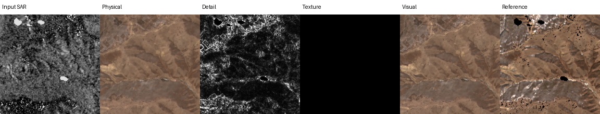

# Sentinel Translate V3.2：当前完整流程、模型与结果

更新日期：2026-08-10（Asia/Shanghai）

代码目录：`/data/code/sentinel_translat/v3.2`

本文是 V3.2 当前主线的单一事实来源。主线数据为 2017–2024 canonical 数据集，固定验证集为
141 个 2023 样本。旧 463 样本、2017–2018 实验和失败的 learned-codec bridge 只作为消融，
不能与当前 checkpoint 或指标混用。

## 1. 当前结论

V3.2 是双方向、双输出的 Sentinel-1/Sentinel-2 条件图像生成模型：

| 方向 | 输入 | 目标 | 单位 |
| --- | --- | --- | --- |
| SAR -> Optical | Sentinel-1 `VV,VH` | Sentinel-2 10 波段；感知评估使用 RGB | surface reflectance `[0,1]` |
| Optical -> SAR | Sentinel-2 10 波段 | Sentinel-1 `VV,VH` | dB backscatter |

两个输出承担不同目标：

```text
physical = deterministic radiometric prediction
visual   = bounded(physical + observable_detail + sampled_innovation)
```

- `physical` 负责 RMSE、SAM、辐射和低频结构，141 样本的四个硬门槛全部通过。
- Optical visual 的 RMSE、DISTS、Edge F1、PSD、越界率和多数场景风险通过；LPIPS 改善
  `3.7111%`，没有达到 `5%`，因此尚不能发布 Optical visual 或 joint checkpoint。
- SAR visual 已通过当前门槛，明显改善 PSD、ENL、直方图以及 P01/P99 亮暗尾部误差。
- 当前 Optical visual 主要来自确定性 phase/anchor detail；随机纹理 release 为零。模型不是
  “已经生成真实随机 RGB 纹理”，图像仍偏平滑。
- 后续研究主线是 Null-Calibrated Orthogonal Phase Carrier（NC-OPC）：只在源图证据超过
  循环移位空假设的频带/位置增加正交细节。连续支持的 1k 消融没有产生有效增益，正在验证
  Binary Null-Exceedance Support（BNES）。这仍是 validation 阶段假设，不是论文结论。

权威产物：

```text
dataset:    /data/datasets/sentinel_translate_v32_2017_2024
checkpoint: checkpoints_v32_canonical_2017_2024/final_calibrated.pt
physical:   checkpoints_v32_canonical_2017_2024/best_physical.pt
validation: reports_v32_canonical_2017_2024/final_validation.json
selection:  checkpoints_v32_canonical_2017_2024/selection.json
protocol:   f72deee58e7c421bd6af9d96164a272717564f94b7c227e4b38fa4e915f61606
```

当前只有 `best_physical.pt` 可发布。三个封闭 test split 尚未运行。

GitHub 内可直接审计的结果快照：

- [`v32_canonical_2017_2024_final_validation_141.json`](results/v32_canonical_2017_2024_final_validation_141.json)
- [`v32_canonical_2017_2024_selection.json`](results/v32_canonical_2017_2024_selection.json)

## 2. 数据、尺寸与防泄漏协议

### 2.1 数据划分

| Split | 年份 | 数量 | 用途 |
| --- | ---: | ---: | --- |
| train candidates | 2017–2022 | 2,050 pair | 训练候选 |
| accepted train | 2017–2022 | 1,947 pair / 31,152 patch | physical 与阶段训练 |
| high-frequency eligible | 2017–2022 | 14,622 patch | detail/flow/phase 高频监督 |
| validation_temporal | 2023 | 141 pair | 选模与所有公开 validation 结论 |
| test_spatial | 2023 | 39 pair | 封闭测试 |
| test_temporal | 2024 | 131 pair | 封闭测试 |
| test_joint | 2024 | 62 pair | 封闭测试 |

训练每个接受 pair 固定提取 16 个 `256 x 256` patch；validation/test 使用固定中心
`256 x 256` crop。全部数据对齐到 10 m 网格。Sentinel-2 通道顺序是
`blue,green,red,rededge1,rededge2,rededge3,nir,nir08,swir16,swir22`，Sentinel-1 是
`vv,vh`。

验证有效 mask 只接受 SCL `2/4/5/6/7`。pair ID、crop、mask、通道、单位和 manifest hash
共同绑定 format-v4 checkpoint；protocol hash 不同的报告禁止合并选模。

### 2.2 高频资格

高频 patch 必须同时满足：

- 只来自 2017–2022 train，validation/test 零接触；
- `delta_days=0/1` 权重分别为 `1.0/0.25`；更长时间差对 residual 参数精确零梯度；
- local-structure NCC 注册审计位移不超过 `0.5 px`；
- valid ratio 至少 `0.8`，cloud/shadow ratio 不超过 `0.2`；
- train-only temporal prior 使用 leave-one-out，不能读取目标帧或 validation/test。

注册审计在 `[-2,2]` 像素内搜索；NCC 至少 `0.10` 且相对零位移提升至少 `0.05` 才报告
非零位移。方法版本和阈值保存在数据集 `hf_eligibility.json`。

## 3. 完整模型

```mermaid
flowchart TD
    X[S1 VV/VH 或 S2 10波段] --> F[方向输入头与 H/1..H/8 FPN]
    F --> T[12层 shared Transformer]
    T --> A[第3/6/9/12层 rank-64 direction adapters]
    A --> R[方向 radiometric decoder]
    R --> P[physical mean + log variance]
    P --> M[train-only temporal calibration 可选]
    M --> PF[冻结 physical]

    F --> D[observable detail / phase anchor]
    PF --> D
    D --> DD[deterministic detail]

    F --> O[conditional origin: mu, sigma, q]
    PF --> O
    O --> Z0[z0 = mu + sigma(q) epsilon]
    Z0 --> DT[8层 Residual-DiT]
    F --> DT
    DT --> B[residual rectified-flow bridge]
    B --> IH[residual decoder / inverse Haar]
    IH --> SR[stochastic residual]

    PF --> C[有界合成]
    DD --> C
    SR --> C
    C --> V[visual]
```

### 3.1 Physical：低频、辐射与共享几何

- 四尺度 CNN/FPN 保留局部几何；H/8 token 进入 hidden 768、12 层、12 头 Transformer。
- 第 3/6/9/12 层使用方向专用 rank-64 residual adapter。
- Optical/SAR 使用各自的 decoder 和轻量 radiometric correction head。
- 输出目标均值与 log variance；训练可使用 PCGrad 处理共享参数的双方向冲突。
- metadata 包含 GSD、季节和轨道信息；有可靠 train-only temporal prior 时校准，无覆盖时
  精确回退 neural physical。

Physical 的标签是完整目标图像 `y`，不是模糊图或低通伪标签。Optical 约束像素、NLL、
梯度、局部结构、SAM、光谱幅度和偏差；SAR 还约束 VV/VH 关系与 dB bias。通过门槛后
physical checkpoint 在所有高频阶段冻结。

### 3.2 确定性高频

令 `p=stopgrad(physical)`，`M` 为有效 mask，`H` 为零低频响应的高通算子：

```text
target_detail = H((y - p) * M) * M
det_detail    = observable_detail(source_FPN, physical_pyramid)
texture_gt    = target_detail - stopgrad(det_detail)
```

原始 `MultiscaleDetailHead` 读取 H/1、H/2、H/4、H/8 FPN，以 Charbonnier、梯度、Edge、
local SSIM 和分频损失学习跨模态可预测边缘。canonical 训练中它的安全释放覆盖很低，不能
承担全图高频。

当前 Optical 使用受保护的三频带 phase/anchor：只搬运 physical 与 source 共同支持的亮度
结构，不确定颜色不做确定性猜测。NC-OPC 在此基础上增加一个严格加法嵌套项：

```text
new_detail = frozen_parallel_detail + orthogonal_source_carrier
```

carrier 先相对 physical 频带亮度做局部正交化，再用循环移位 source 构造 null coherence。
零初始化保证新模型 step 0 与 canonical phase checkpoint 逐位一致；carrier 关闭时也必须精确
回退。BNES 只在真实 coherence 大于 null coherence 的位置开放载波，目标是避免连续支持把
梯度压到不可见量级。

### 3.3 随机高频与 residual bridge

共享 residual codec 是 4 倍压缩、16-channel standardized latent，Optical/SAR 使用独立
I/O heads。主 Residual-DiT 为 hidden 512、8 层、8 头，四尺度条件经过零初始化 gate 注入。

Optical 的 phase-identifiability 路线使用 two-level Haar packet residual state：RGB 每通道
16 个系数，共 48 通道；LL->LL 系数固定为零，防止随机分支改写 physical 低频。SAR 当前
发布路径保留经验证的 16-channel residual state。离开训练流形后产生彩色 checkerboard 的
旧 learned-codec Optical bridge 已否决，不是当前最佳模型。

conditional origin 预测 `mu`、`log_sigma` 和三个频带的 identifiability `q`：

```text
z0 = mu + flow_noise_scale * sigmoid(log_sigma) * (1 - q) * epsilon
z1 = standardized paired texture_gt residual
zt = (1 - t) * z0 + t * z1
velocity_gt = z1 - z0
```

推理以固定 seed 从 `z0` 积分到 residual endpoint。它是带条件中心的 residual rectified-flow
bridge，不是 DDPM，也不是从纯高斯噪声重新生成整幅图。生成自由度只作用于 physical 未解释
的 residual。Optical 当前校准将 stochastic release 设为零；SAR stochastic residual 已发布。

### 3.4 合成与接口

`translate(..., mode="physical"|"visual")` 保持兼容。`TranslationResult` 可返回：

- `physical`
- `deterministic_detail`
- `stochastic_residual`
- `residual_amplitude`
- `pre_projection_violation`

Optical 先报告线性候选的越界比例，再转换为 logit-space 增量并 sigmoid 到 `[0,1]`；不能用
clamp 掩盖幅度失控。SAR 在 dB 域合成并约束到合法显示范围。主结果使用预注册 fixed seed，
禁止 best-of-K。

## 4. 监督标签与损失

### 4.1 Physical 标签

```text
SAR -> Optical: y = 10-channel surface reflectance
Optical -> SAR: y = 2-channel VV/VH dB backscatter
```

### 4.2 Detail 与 flow 标签

```text
r_full     = H((y - p) * M) * M
d_obs      = deterministic observable detail
r_texture  = r_full - stopgrad(d_obs)
z1         = codec_or_Haar(r_texture), standardized
z0         = conditional origin mu + calibrated noise
v_target   = z1 - z0
```

Flow 同时约束 robust velocity、单步 endpoint、rollout endpoint、gradient、DISTS 和频谱；
SAR 额外约束径向 PSD、ENL、局部方差、CDF/直方图与 P01/P99。幅度、q 与 sigma 必须校准，
随机 residual 的条件均值接近零，不能系统性搬动 physical radiometry。

### 4.3 NC-OPC 标签

训练先从目标高频中减去冻结 anchor 和 parallel phase prediction，再计算 source carrier 对
剩余三频带 residual 的 signed oracle coefficient。只在有效且超过 null 的 support 上计算
signed alignment；无 support 时 loss 必须有限且精确为零。其目的不是重建 target-only 纹理，
而是检验 source 中是否存在被 frozen parallel 路径遗漏、且可传输到目标的方向性结构。

## 5. 实际训练链

canonical 主链使用 8x A100、BF16、EMA、4 worker/rank、persistent workers 和 prefetch 2。

| Stage | 实际 step | 有效 global batch | LR | 墙钟 |
| --- | ---: | ---: | --- | ---: |
| physical | 7,000 | 64 | encoder `2e-6`，main `1e-5`，adapter `1e-4` | 4:05:10 |
| codec | 20,000 | 64 | `1e-4` | 0:53:43 |
| detail | 9,000 | 64 | `1e-4` | 1:01:34 |
| flow | 6,000 | 64 | `1e-4` | 1:58:24 |
| phase_transport | 5,000 | 16 | `1e-4` | 0:35:57 |

正式 stage 合计约 8 小时 35 分；含阶段间 calibration 与检查，主链约 8 小时 55 分。
physical 最佳候选是 step 4k，后续始终冻结。codec 达到 Optical MAE `0.002582`、SAR MAE
`0.523176 dB`；detail 和 flow 因验证无改善分别在 9k/6k 停止。

高频实验遵循逐级 stop rule：

```text
64 patch / 100 step connectivity
  -> 1k quick32 pilot
  -> 5k full-141 validation
  -> 20k-40k full training
  -> 5k calibration
```

每一级都必须保持 physical 逐位不变、`delta_days>1` residual 零梯度、fixed seed 可复现，
并通过 RMSE/越界/伪影门槛。训练规模不能覆盖错误的生成分布。

## 6. 当前 141 样本结果

### 6.1 Physical：已完成

| 指标 | 当前值 | 门槛 | 状态 |
| --- | ---: | ---: | --- |
| SAR -> Optical RMSE | `0.0326609` | `<=0.03909` | 通过 |
| SAR -> Optical SAM | `5.58075 deg` | `<=5.716 deg` | 通过 |
| Optical -> SAR RMSE | `4.50149 dB` | `<=5.0 dB` | 通过 |
| Optical -> SAR signed bias | `0.01087 dB` | `<=0.5 dB` | 通过 |

### 6.2 Optical visual：尚差一个硬指标

| 指标 | Physical | Visual | 结果 |
| --- | ---: | ---: | --- |
| RGB RMSE | `0.0266392` | `0.0269534` | `1.01180x`，通过 |
| LPIPS | `0.199744` | `0.192331` | 改善 `3.7111%`，未到 5% |
| DISTS | `0.204725` | `0.190849` | 改善 `6.7778%`，通过 |
| Edge F1 | `0.439870` | `0.523919` | 改善 |
| PSD distance | `0.00611677` | `0.00604207` | 改善 |
| pre-projection violation | - | `0.016716%` | 通过 |

`94.33%` 场景 Edge 改善，`87.23%` DISTS 改善，`97.16%` 至少一项改善；`7.09%`
场景 RGB RMSE 退化超过 5%，低于 10% 上限。LPIPS 是唯一 aggregate 硬失败项。

### 6.3 SAR visual：当前通过

| 指标 | Physical/mean | Visual | 结果 |
| --- | ---: | ---: | --- |
| signed bias | `0.01087 dB` | `0.01635 dB` | 通过 |
| PSD distance | `0.65475` | `0.28154` | 改善 |
| ENL error | `0.18116` | `0.07391` | 改善 |
| histogram distance | `0.004823` | `0.001350` | 改善 |
| P01 error | `4.1113 dB` | `1.6178 dB` | 改善 |
| P99 error | `5.3851 dB` | `2.9792 dB` | 改善 |

### 6.4 NC-OPC 消融状态

严格 phase-5k quick32 baseline：RMSE ratio `1.0153973`，LPIPS 改善 `4.0671%`，DISTS
改善 `6.8158%`。连续 null support 的 1k pilot 从 step 250 到 1000 与 baseline 的变化均不
超过约 `0.0013` 个百分点；carrier delta RMS 仅 `4.1e-6` 到 `1.8e-5`。这不是数值崩溃，
而是支持幅度过小，所以该版本不扩训。BNES 必须先证明 carrier delta 可测且不破坏 baseline，
才允许进入完整 141 验证。

## 7. 可视化解读

canonical panel 位于：

```text
reports_v32_canonical_2017_2024/final_validation_panels
```



SAR -> Optical 面板通常依次显示 Input、Physical、Detail、Texture、Visual、Reference：

- Physical 已恢复大尺度色彩、地物布局和辐射，但道路、屋顶和田块内部仍偏平滑。
- Detail 的亮/暗是有符号 residual 的显示，不是白色/黑色地物。
- Texture 全黑表示当前 Optical stochastic release 精确为零，不是缺数据。
- Reference 的成片纯黑或不规则黑洞通常在 valid mask 外或原始数据无效；不能解释为真实
  黑色地表。
- Visual 比 Physical 边缘更清晰，DISTS/Edge/PSD 已改善，但没有恢复 target 独有的颜色与
  细纹理，因此不能把它描述成真实高频已解决。

Optical -> SAR 中，白亮通常是强后向散射，深色是低后向散射。Visual 已恢复更多 speckle
以及强/弱散射尾部；这些随机细节不可能逐像素对应唯一 reference，因此用 PSD、ENL、CDF、
P01/P99 和 bias 评价，而不是挑选最像 reference 的 seed。

历史示例仍保留在 `docs/assets`；其中 failed codec flow 的彩色格纹是伪影，不是有效纹理。

## 8. 完成目标的标准

Physical 已完成，但最终 visual 只有同时满足以下条件才算整个目标完成：

- Physical 四个门槛在最终 checkpoint 上保持通过；
- Optical RGB RMSE `<=1.05 x Physical`；
- LPIPS 和 DISTS 各改善至少 5%；
- Edge F1 提高且 Optical PSD distance 降低；
- pre-projection violation `<=0.1%`；
- 至少 70% 场景 Edge F1 或 DISTS 改善；
- RMSE 退化超过 5% 的场景不超过 10%；
- SAR bias `<=0.5 dB`，PSD、ENL、histogram、P01/P99 全部优于 physical；
- texture-rich/sparse、地类和时间切片一致，paired Wilcoxon + Holm `p<0.05`，报告 95%
  bootstrap CI；
- validation 选模锁定后，三个封闭 test split 均支持结论；禁止 best-of-K。

## 9. 论文定位与创新假设

当前论文主张候选是 **Null-Calibrated Orthogonal Residual Bridge**，而不是模块列表：

1. 先用硬门槛冻结可识别的跨模态辐射和低频；
2. 将可观测结构与不可辨识纹理分离，生成分支不能改写低频；
3. 用 source cyclic-shift null 作为样本内反事实，只有超过空假设的方向性证据才能进入
   orthogonal carrier；
4. additive zero-init nesting 让每次方法升级都有严格、可复现实验对照；
5. residual bridge 只生成 physical 未解释的条件分布，并受 5% distortion budget 约束。

这比“Transformer + wavelet + flow”简单拼接更可检验，但只有 BNES/full-141/closed-test
消融真正改善指标后才能作为已验证创新。当前不能声称 SOTA 或论文目标完成。

设计借鉴但不照搬：

- [UPSR, CVPR 2025](https://openaccess.thecvf.com/content/CVPR2025/html/Zhang_Uncertainty-guided_Perturbation_for_Image_Super-Resolution_Diffusion_Model_CVPR_2025_paper.html)
- [HDW-SR, CVPR 2026](https://openaccess.thecvf.com/content/CVPR2026/html/Yang_HDW-SR_High-Frequency_Guided_Diffusion_Model_based_on_Wavelet_Decomposition_for_CVPR_2026_paper.html)
- [Residual Diffusion Bridge, CVPR 2026](https://openaccess.thecvf.com/content/CVPR2026/html/Wang_Residual_Diffusion_Bridge_Model_for_Image_Restoration_CVPR_2026_paper.html)
- [CDTSDE, ICLR 2026](https://openreview.net/forum?id=it0GTdiW9t)
- [TexADiff, CVPR 2026](https://openaccess.thecvf.com/content/CVPR2026/html/Zhang_Remote_Sensing_Image_Super-Resolution_for_Imbalanced_Textures_A_Texture-Aware_Diffusion_CVPR_2026_paper.html)

V3.2 不使用 MAE，不使用 GAN，也不引入自然图像 text-to-image 大底座。

## 10. 复现与能力边界

完整 canonical 训练事实见
[`V32_CANONICAL_2017_2024_TRAINING_REPORT_ZH.md`](V32_CANONICAL_2017_2024_TRAINING_REPORT_ZH.md)。

基础验证：

```bash
cd /data/code/sentinel_translat/v3.2
PYTHONPATH=src pytest -q
ruff check .
git diff --check
```

重新评估 validation：

```bash
CUDA_VISIBLE_DEVICES=7 PYTHONPATH=src python -m sentinel_v3.cli \
  --config configs/canonical_2017_2024_phase_transport.yaml \
  evaluate \
  --checkpoint checkpoints_v32_canonical_2017_2024/final_calibrated.pt \
  --split validation_temporal \
  --output reports_v32_canonical_2017_2024/final_validation.json
```

能力边界：SAR 和 Optical 是 many-to-many。模型可以恢复共同几何和合理条件分布，不能从
SAR 唯一确定真实 RGB 色彩/纹理，也不能从 Optical 唯一确定真实 speckle。网络可处理已标定
尺寸/GSD 的 patch，但不能声称支持任意传感器或任意分辨率；新传感器必须补齐物理描述符、
通道/单位、PSF/MTF、配对训练数据和独立验证。
