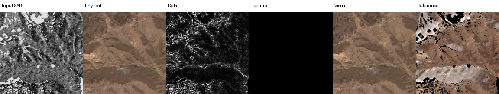

# Sentinel Translate V3.2：完整模型、监督标签、训练流程与当前结果

更新日期：2026-08-09

代码目录：`/data/code/sentinel_translat/v3.2`

固定验证协议：`validation_temporal`，463 个样本，协议哈希：
`891d34fe1e507ce66b8f6d7f93d096ad911f77112ad57fe22611c8ec4b46594b`

本文是 V3.2 当前状态的单一事实来源。文中严格区分“完整验证通过”、
“完整验证未通过”和“仅 connectivity 实验”三种状态，不把设计或小样本结果写成最终结论。

## 1. 一页结论

V3.2 是一个双向、双输出的 Sentinel-1/Sentinel-2 图生图模型：

| 方向 | 输入 | 输出 | 单位 |
| --- | --- | --- | --- |
| SAR→Optical | Sentinel-1 VV/VH | Sentinel-2 10 波段；visual 使用 RGB | 反射率 `[0,1]` |
| Optical→SAR | Sentinel-2 10 波段 | Sentinel-1 VV/VH | dB |

模型不强迫同一个输出同时获得最低 RMSE 和最丰富纹理：

```text
physical = 确定性的辐射/低频/可辨识结构预测
visual   = bounded(physical + observable_detail + sampled_innovation)
```

- `physical` 是论文的 RMSE、SAM 和 bias 主结果，已在 463 样本上通过全部硬门槛。
- Optical 当前最好的完整验证结果是 source-aware deterministic anchor：RMSE 只退化
  `1.945%`，Edge F1 和 PSD 改善，但 LPIPS/DISTS 只改善 `3.35%/4.21%`，且
  `12.31%` 场景 RMSE 退化超过 5%，因此仍未达到最终 Optical visual 门槛。
- SAR visual 已能明显改善 PSD、ENL、直方图和 P01/P99 尾部，解决一部分“只生成中间
  dB 值”的问题。
- 新的 Identifiability-conditioned Haar residual flow 已通过单测、8 卡 smoke 和 100-step
  connectivity。它修复了旧 codec bridge 的彩色格纹和 anchor 信息损失，但尚未证明带来
  超过 source-anchor 的 Optical 增益，所以没有盲目启动 1k/40k 全量训练。
- 当前结果还不能作为“完整双向 visual 已达到 SOTA”的论文结果；可以作为方法原型和
  正负实验链条，最终投稿仍需 Optical 完整验证过门槛、消融和封闭 test。

## 2. 输出接口与物理边界

`translate(..., mode="physical"|"visual")` 保持兼容。

`mode="visual"` 的 `TranslationResult` 提供：

- `physical`：冻结的确定性底座；
- `deterministic_detail`：可观测、可对齐的像素域细节；
- `stochastic_residual`：Haar innovation flow 解码结果；
- `residual_amplitude`：旧 codec flow 的幅度图，id bridge 路径可为空；
- `pre_projection_violation`：合成前越界比例。

Optical 不用 clamp 掩盖失控幅度。代码先计算线性候选的越界率，再将 detail/residual
换算为 logit 增量并经 sigmoid 回到 `[0,1]`。SAR 在 dB 域相加，最后限制到
`[-50,5] dB`。固定 seed 必须逐位可重复；主结果禁止 best-of-K。

## 3. 数据与防泄漏协议

### 3.1 数据范围

- 训练只使用 2017–2018 train split。
- validation/test 图像不得进入 physical、detail、codec、flow 或 calibration 训练。
- 固定 manifest 决定 pair、中心 crop、有效 mask、通道顺序和单位。
- 463 validation 报告只有 protocol hash 相同才可比较或选 checkpoint。

### 3.2 高频样本审计

高频监督只接受时相接近且配准可靠的 patch：

```text
delta_days = 0 -> weight 1.00
delta_days = 1 -> weight 0.25
delta_days = 2/3 -> weight 0.00
```

`delta_days>1` 对所有 residual 参数必须精确零梯度。估计位移大于 `0.5 px`、云/阴影、
低有效比例等 patch 由 `hf_eligibility` sidecar 排除；当前 sidecar 有 3,044 个可用 patch。
时序先验也只索引 train acquisition，并采用 leave-one-out sidecar，防止目标帧泄漏。

## 4. 完整模型框架

```mermaid
flowchart TD
    X[S1 VV/VH 或 S2 10波段] --> CP[动态物理通道投影]
    CP --> FPN[H/1 H/2 H/4 H/8 CNN金字塔]
    FPN --> TR[12层共享Transformer]
    TR --> AD[3/6/9/12层方向rank-64 adapter]
    AD --> RD[方向专用radiometric decoder]
    RD --> P0[neural physical + log variance]
    P0 --> TP[train-only时序先验 可选]
    TP --> P[冻结physical]

    FPN --> DA[可观测detail/physical频带anchor]
    P --> DA
    DA --> D[像素域observable detail]

    FPN --> IO[Identifiability origin head]
    P --> IO
    IO --> Z0[z0 = mu + sigma(q) epsilon]
    FPN --> DIT[8层512维Residual-DiT]
    Z0 --> DIT
    DIT --> FM[Heun积分到Haar innovation endpoint]
    FM --> IH[精确逆Haar]
    IH --> R[sampled innovation]

    P --> C[有界合成]
    D --> C
    R --> C
    C --> V[visual]
```

这不是把一个自然图像扩散模型接在翻译器后面的简单拼接。physical、可观测 detail、
不可辨识 innovation 使用同一个源图金字塔条件，并在统一的 residual 标签、失真预算和
identifiability 场中训练；但当前 Optical innovation 的额外收益仍是待验证假设。

### 4.1 Physical：低频、辐射和共享几何

- 每个输入波段使用物理描述符，支持 S1/S2 不同通道数与物理含义。
- CNN 保留四尺度空间特征；H/8 进入 hidden=768、12 层、12 头 Transformer。
- 第 3/6/9/12 层各有 Optical/SAR rank-64 residual adapter。
- 方向专用 decoder 输出目标均值和 log variance，并使用完整 FPN 恢复空间结构。
- 条件包含输入/目标 GSD、季节、轨道等 metadata；共享参数双任务训练可使用 PCGrad。
- train-only temporal prior 有覆盖时做季节辐射修正，无覆盖时严格回退 neural physical。

physical 的标签就是目标传感器完整像素，不是低通后的伪标签。Optical 联合像素、NLL、
梯度、局部结构、SAM、光谱幅度和 bias；SAR 还约束 VV/VH 关系及 dB bias。

### 4.2 可观测 deterministic detail

旧的学习式 `MultiscaleDetailHead` 使用 H/1–H/8 FPN、三层 Laplacian band、
Charbonnier/gradient/Edge/local-SSIM 和置信度门控。完整校准发现它能安全释放的覆盖率接近
零，说明跨模态逐像素回归全部残差不可行。

当前效果最好的 Optical detail 改为 source-aware physical anchor：

1. 对冻结 `physical_rgb` 做三层 Laplacian 分解；
2. 基础 fine-band scale 为 `0.20`；
3. physical 纹理密度高的 4×4 区域额外增加 `0.10`；
4. source FPN 高频密度超过场景均值 `1.30×` 的区域额外增加 `0.70`；
5. 最后再次 high-pass，确保不会改写 physical 的低频辐射。

这些系数来自 validation calibration，并已在 463 样本报告中验证。它主要增强源图可支持的
边界，而不尝试确定性猜测 SAR 中不存在的 RGB 颜色纹理。

### 4.3 当前高频状态：精确 Haar innovation

旧 residual codec 对自身重建可以过 gate，但 id bridge 的 latent 只要稍微偏离训练流形，
decoder 就会放大为彩色 checkerboard。修正后的状态不再经过 learned codec：

- 对 residual 做两层正交 Haar packet，H/4 网格每个视觉通道有 16 个系数；
- Optical 为 `3×16=48` 通道；SAR 为 `2×16=32`，零填充到 48；
- 每个视觉通道的 LL→LL 系数强制为零，SAR padding 也始终为零；
- Optical/SAR 固定标准化 scale 分别为 `0.03/4.0`；
- 逆变换是精确的，不存在 learned decoder 的离流形放大。

因此 flow 只允许修改两层 Haar 支持下的正交高频子空间，不能偷偷改变低频。

### 4.4 Identifiability-conditioned origin 与 Residual-DiT

origin head 同时读取 source FPN 和 physical Haar 高频，输出：

```text
mu             : 条件可预测的 innovation 中心
log_sigma      : 每位置/通道不确定度
q logits (3带) : 三个频带的 identifiability/reliability
```

Residual-DiT 为 `D=512`、8 层、8 头。H/1、H/2、H/4、H/8 分别投影到 H/4 latent 网格，
通过零初始化 gate 注入每层；DiT 输出层也为零初始化。当前 observable-anchor 配置中：

```text
z0 = mu + flow_noise_scale * sigmoid(log_sigma) * (1-q) * epsilon
z1 = Haar(texture_innovation_gt)
zt = (1-t) z0 + t z1
velocity_gt = z1 - z0
```

推理用固定 seed 采样 `epsilon`，以 Heun 积分从 `t=0` 到 `t=1`，然后按 `q` 和方向
innovation scale 门控并精确逆 Haar。

## 5. 标签到底是什么

令 `y` 为目标、`p=stopgrad(physical)`、`M` 为有效 mask、`H` 为高通投影，
`d_obs` 为冻结像素域 observable anchor。

### 5.1 SAR→Optical

```text
full_residual_gt = H((y_rgb - p_rgb) * M) * M
d_obs             = source_aware_physical_anchor(p_rgb, source_FPN)
innovation_gt     = P_Haar((full_residual_gt - d_obs) * M)
z1                = Haar(innovation_gt) / 0.03
visual            = bounded(p_rgb + d_obs + Haar_inverse(z_hat))
```

当前 100-step connectivity 配置将 Optical `innovation_scale=0`，即先验证像素 anchor 能
逐项无损保留，避免未成熟随机纹理破坏结果。训练仍给 DiT endpoint/velocity 梯度，用于
诊断 innovation 是否可学；只有 quick/full 验证证明改善后才允许发布非零 transport。

### 5.2 Optical→SAR

```text
full_residual_gt = P_Haar((y_db - p_db) * M)
d_obs            = 0
innovation_gt    = full_residual_gt
z1               = Haar(innovation_gt) / 4.0
visual_db        = bounded(p_db + Haar_inverse(z_hat))
```

SAR 的随机 speckle 和强/弱散射尾部不能逐像素唯一恢复，因此不以 sampled visual 的
单次 RMSE 作为真实性结论，而评价 bias、径向 PSD、ENL、histogram 和 P01/P99。

### 5.3 Identifiability 伪标签与损失

`q_oracle` 由 source 高频与三频带 target residual 的局部一致性构造，只用于训练；推理
只由 source+physical 预测 `q`。总目标包含：

- robust velocity loss；
- 单步 endpoint 高频重建、gradient、spectrum，SAR 再加 speckle-scale；
- origin correction 的可靠区拟合/不可靠区收缩；
- `q` 的 BCE 与 `sigma` 幅度校准；
- Optical 的 `d_obs + decode(mu)` 高频监督；
- rollout visual 的 5% RMSE hinge、LPIPS/DISTS；
- SAR rollout 的高频统计损失。

physical 在所有高频阶段冻结，以上损失不能反向改变已通过门槛的低频底座。

## 6. 是从噪声恢复，还是桥扩散

准确答案是：**当前是带条件中心的 residual rectified-flow bridge，不是 DDPM，也不是从
纯噪声生成整幅图。**

- 它没有 DDPM 的离散加噪/去噪马尔可夫链，也不预测 diffusion noise schedule。
- 它在 residual Haar state 中，从 `mu + sigma(q)epsilon` 连续输运到配对目标 residual
  endpoint；所以具有“桥”的起点/终点语义。
- `mu` 来自 source+physical，`sigma` 只在低 identifiability 区域开放随机自由度。
- 最终生成的是 physical 未解释的创新，而不是重新生成已正确的整幅 RGB/SAR。
- 旧 codec route 是“高斯噪声到 learned residual latent”的标准 conditional rectified
  flow；已因 decoder 离流形伪影被否决。

## 7. 从 physical 到高频的实际开发与训练顺序

### A. 统一协议并修复 physical

1. 固定 463 pair/crop/mask/unit/hash。
2. 同协议重评旧 Mean/Refiner/多个 physical step。
3. 加方向 adapter、radiometric head 和 PCGrad 恢复双向门槛。
4. 通过完整验证后冻结 checkpoint；旧 checkpoint 只允许 `--init-model`，不恢复旧 optimizer。

### B. 审计高频数据

1. 只使用 train 2017–2018。
2. 生成 temporal prior 和 `hf_eligibility` sidecar。
3. 强制 `delta_days=0/1` 权重 `1/0.25`，其余 residual 零梯度。

### C. 已验证/否决的高频路线

1. 学习式 detail：安全覆盖率接近零，保留代码但不作为当前成功结果。
2. learned residual codec：重建 gate 通过，但 bridge step1000 产生严重彩色格纹，否决。
3. 无 anchor 的 exact Haar flow：step100 无格纹且 RMSE 安全；继续到 step600 Optical
   感知指标单调恶化，提前停止。
4. source-aware pixel anchor：完整 463 上接近最终门槛，是当前最好 Optical visual。
5. pixel anchor + Haar innovation：修正 anchor 被 Haar 投影损失的问题；完成 128 单测、
   8 卡双向 smoke 和 step100 quick32。当前 step100 与纯 anchor 基线几乎完全一致，说明
   表示修复成立，但尚无新增 Optical 收益。

### D. 扩训规则

```text
64-patch/100-step connectivity
    -> quick32 确实优于 anchor 才跑 1k
    -> 1k 通过 RMSE/越界/无伪影才跑 5k
    -> 5k 完整463全部过门槛才跑 20k/40k
    -> 最后5k只校准 q/sigma/amplitude，不解冻 physical
```

这套 stop rule 的目的不是节省工程时间，而是防止用训练规模掩盖错误生成分布。当前没有
启动 1k，是因为 step100 只证明“无损保留 anchor”，还没证明 Optical innovation 有收益。

## 8. 当前定量结果

### 8.1 Physical：完整 463，已通过

| 指标 | 当前值 | 硬门槛 | 状态 |
| --- | ---: | ---: | --- |
| SAR→Optical RMSE | 0.0382369 | ≤ 0.03909 | 通过 |
| SAR→Optical SAM | 5.59574° | ≤ 5.716° | 通过 |
| Optical→SAR RMSE | 4.87565 dB | ≤ 5.0 dB | 通过 |
| Optical→SAR signed bias | 0.15234 dB | ≤ 0.5 dB | 通过 |

报告：[v32_physical_full_463.json](results/v32_physical_full_463.json)。

### 8.2 当前最佳 source anchor：完整 463

| Optical 指标 | Physical | Visual | 结果 |
| --- | ---: | ---: | --- |
| RGB RMSE | 0.0244237 | 0.0248987 | `1.01945×`，通过 5% aggregate guardrail |
| LPIPS | 0.258653 | 0.249987 | 改善 `3.35%`，未到 5% |
| DISTS | 0.241518 | 0.231339 | 改善 `4.21%`，未到 5% |
| Edge F1 | 0.422152 | 0.478237 | 改善 |
| PSD distance | 0.00519312 | 0.00517585 | 改善 |
| 合成前越界 | - | `0.00496%` | 通过 |
| 场景 RMSE 退化>5% | - | `12.31%` | 未到 ≤10% |

`73.87%` 场景 Edge 改善，`79.48%` 场景 DISTS 改善。报告：
[v32_source_anchor_full_463.json](results/v32_source_anchor_full_463.json)。

同一 checkpoint 的 SAR visual 也改善：PSD `0.44849→0.24542`、ENL error
`0.11401→0.06870`、histogram `0.004137→0.001469`、P01 error
`4.0265→1.8455 dB`、P99 error `6.1391→4.5238 dB`。

### 8.3 pixel anchor + Haar innovation：step100 quick32

| 指标 | Source-anchor quick32 | 新 bridge step100 | 结论 |
| --- | ---: | ---: | --- |
| Visual/Physical RMSE | 1.018319× | 1.018319× | 无损保留 |
| LPIPS 改善 | 3.1939% | 3.1931% | 基本相同 |
| DISTS 改善 | 3.9404% | 3.9411% | 基本相同 |
| Edge F1 | 0.433289 | 0.433265 | 基本相同 |
| RMSE退化>5%场景 | 9.375% | 9.375% | 通过 quick 门槛 |

报告：[v32_id_bridge_pixel_anchor_step100_quick32.json](results/v32_id_bridge_pixel_anchor_step100_quick32.json)。
这证明像素 anchor 不再被 Haar 丢失，但不能解释为 innovation 已经改善 Optical。

### 8.4 两个关键失败对照

- learned-codec id bridge step1000：RMSE `1.3897×`，LPIPS/DISTS 分别恶化约
  `115.9%/61.0%`，面板出现彩色 checkerboard；已否决。
- unanchored exact-Haar：step100 RMSE `1.0091×` 且无 checkerboard；训练到 step600
  后 RMSE `1.0637×`、LPIPS/DISTS 恶化 `18.87%/13.39%`，说明表示正确不等于目标
  transport 正确；已提前停止。

对应报告都保存在 [docs/results](results/) 中，失败结果不会被覆盖或删除。

## 9. 当前可视化如何解读

### 9.1 当前最佳 source anchor



从左到右为 Input SAR、Physical、Detail、Texture、Visual、Reference。

- Physical 已恢复大尺度颜色、地物布局和辐射，但屋顶、道路、田块边缘仍偏平滑。
- Detail 是有正负号的 residual 可视化。显示为白/亮表示绝对响应强，不代表白色地物；
  黑色表示该位置 detail 接近零。
- Texture 为黑是当前 Optical innovation 没有发布，不是缺数据。
- Visual 相比 Physical 的边缘更清晰，统计上 Edge/DISTS/LPIPS 都改善，但远没有恢复
  Reference 中全部独有颜色和细纹理。
- Reference 中成片纯黑/不规则黑洞通常是 valid mask 外或原数据无效区，不能解释为真实
  黑色地表；SAR 面板中的正常暗像素则可能是真实低后向散射。

### 9.2 被否决的 codec flow


该图中的彩色散点/格纹不是“更丰富的高频”，而是 learned decoder 把离流形 latent
误差放大后的伪影。虽然某些频谱统计可能变近，但 LPIPS/DISTS 和逐场景 RMSE 明显变坏，
因此不能用肉眼锐度或 PSD 单项把它写成成功。

### 9.3 SAR visual


- Mean VV/VH 是 physical，倾向条件中值，亮暗尾部不足。
- Sample VV/VH 增加 speckle 和强/弱散射尾部；目前统计上比 mean 更接近 reference。
- SAR 的白亮通常是强后向散射，深色是低后向散射；只有 mask 外纯黑才表示无数据。
- 随机 speckle 不可能逐像素恢复唯一真值，所以 fixed-seed sample 用分布统计评价。

## 10. 什么水平才算完成目标

### Physical（已完成）

完整 463 validation 同时通过 RMSE/SAM/bias 四项门槛，且高频训练后逐项不变。

### Optical visual（尚未完成）

- RGB RMSE ≤ `1.05 × Physical`；
- LPIPS 与 DISTS 各改善 ≥5%；
- Edge F1 提高且 Optical PSD distance 降低；
- 合成前越界 ≤0.1%；
- 至少 70% 场景 Edge F1 或 DISTS 改善；
- RMSE 退化超过 5%的场景 ≤10%；
- texture-rich/sparse、时相和地类切片不能由少数容易场景掩盖。

### SAR visual（当前验证已通过，最终仍需随最终 checkpoint 复核）

- signed bias ≤0.5 dB；
- PSD、ENL、histogram、P01/P99 全部优于 physical mean；
- 多 seed 有纹理差异，但局部均值和结构方差受控。

validation 选模完成后才能运行三个封闭 test split。论文表格使用预注册 fixed seed；多 seed
只用于覆盖率和分布校准，禁止 best-of-K。

## 11. 论文导向的方法定位

当前最有潜力的统一方法名是 **Identifiability-Conditioned Orthogonal Residual Flow
Bridge**，核心不是“Transformer + Haar + flow”的部件列表，而是一个可检验的分解：

1. 经硬门槛验证的 physical 固定可识别的辐射和低频；
2. source/physical 共同支持的边缘留在像素域 deterministic anchor；
3. 两层正交 Haar 将生成自由度限制在不改写低频的 innovation 子空间；
4. `q` 同时控制起点不确定度、可预测 correction 和 transport 幅度；
5. 以 5% distortion budget 和多数场景门槛约束 perception-distortion trade-off。

它借鉴但不照搬 2025–2026 方法：

- [UPSR, CVPR 2025](https://openaccess.thecvf.com/content/CVPR2025/html/Zhang_Uncertainty-guided_Perturbation_for_Image_Super-Resolution_Diffusion_Model_CVPR_2025_paper.html)：用空间不确定度控制生成自由度；
- [HDW-SR, CVPR 2026](https://openaccess.thecvf.com/content/CVPR2026/html/Yang_HDW-SR_High-Frequency_Guided_Diffusion_Model_based_on_Wavelet_Decomposition_for_CVPR_2026_paper.html)：只生成 PreSR 未解释的 wavelet residual；
- [Residual Diffusion Bridge, CVPR 2026](https://openaccess.thecvf.com/content/CVPR2026/papers/Wang_Residual_Diffusion_Bridge_Model_for_Image_Restoration_CVPR_2026_paper.pdf)：用 residual bridge 避免重建已正确区域；
- [CDTSDE, ICLR 2026](https://openreview.net/forum?id=it0GTdiW9t)：用空间/通道自适应跨模态轨迹处理局部 domain shift。

与这些工作的差别应通过消融证明，而不是只在文字中声称：无 `q`、无 pixel anchor、
codec latent vs exact Haar、允许/禁止 LL→LL、固定 Gaussian origin vs conditional origin、
1/4/8/16 steps、Optical/SAR 分方向结果。还需 paired Wilcoxon + Holm 和 bootstrap 95% CI。

目前创新结构已经形成，但 Optical 主指标未过门槛，因此还不能声称论文方法已验证成功。

## 12. 运行、checkpoint 与复现

关键产物：

```text
已过 physical：
  checkpoints_v32_temporal/best_physical.pt

当前最佳完整463 source anchor：
  checkpoints_v32_anchor_source/full463_candidate.pt

Haar pixel-anchor connectivity：
  checkpoints_v32_id_bridge_haar_anchor_connectivity_v4/

报告：
  docs/results/v32_physical_full_463.json
  docs/results/v32_source_anchor_full_463.json
  docs/results/v32_id_bridge_pixel_anchor_step100_quick32.json
```

代码质量验证：

```bash
cd /data/code/sentinel_translat/v3.2
PYTHONPATH=src pytest -q
ruff check src tests
git diff --check
```

8 卡双向 smoke：

```bash
CUDA_VISIBLE_DEVICES=0,1,2,3,4,5,6,7 OMP_NUM_THREADS=1 PYTHONPATH=src \
torchrun --standalone --nproc_per_node=8 -m sentinel_v3.cli \
  --config configs/smoke_id_bridge_haar_anchor.yaml train \
  --limit 64 \
  --init-model checkpoints_v32_anchor_source/full463_candidate.pt \
  --output checkpoints_v32_id_bridge_haar_anchor_smoke \
  --reports reports_v32_id_bridge_haar_anchor_smoke --save-final
```

100-step connectivity：

```bash
CUDA_VISIBLE_DEVICES=0,1,2,3,4,5,6,7 OMP_NUM_THREADS=1 PYTHONPATH=src \
torchrun --standalone --nproc_per_node=8 -m sentinel_v3.cli \
  --config configs/id_bridge_haar_anchor_connectivity.yaml train \
  --limit 64 \
  --init-model checkpoints_v32_anchor_source/full463_candidate.pt \
  --output checkpoints_v32_id_bridge_haar_anchor_connectivity \
  --reports reports_v32_id_bridge_haar_anchor_connectivity --save-final
```

Checkpoint format 为 v4，保存 residual state metadata、codec/version、协议 hash、最佳指标、
EMA 及各 optimizer/scheduler 状态。V3.1 权重只能作为 `--init-model` 兼容初始化，不能恢复
旧 optimizer；所有 V3.2 产物留在独立 `checkpoints_v32*` 路径。

## 13. 能力边界

- SAR→Optical 是 many-to-many。模型可恢复共同几何和条件分布合理的纹理，不能承诺找回
  SAR 从未观测到的唯一真实颜色/屋顶纹理。
- Optical→SAR 的 speckle 和极端散射同样不唯一；physical 负责确定性辐射，visual 负责
  条件统计真实性。
- 当前网络可处理满足下采样尺寸约束的不同 patch 大小和 GSD 条件，但不能声称支持任意
  未见传感器或任意分辨率。新传感器需要物理描述符、单位/PSF/MTF 标定、配对训练数据和
  独立验证。
- 当前可视化比最初 physical 更锐，SAR 尾部显著改善；Optical 仍只是“安全的小幅细节
  增强”，不是完成了真实高频恢复。
